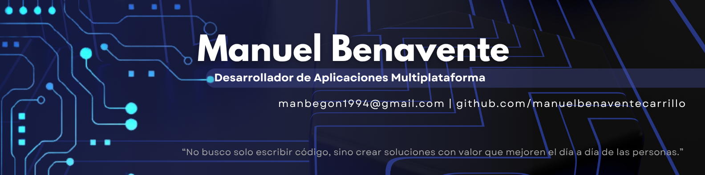

<!-- Banner -->

  

# 👋 ¡Hola! Soy Manuel Benavente 💻

💻 Técnico Superior en Desarrollo de Aplicaciones Multiplataforma (DAM) apasionado por el desarrollo de software y la mejora continua.
Me gusta transformar ideas en aplicaciones funcionales y bien diseñadas, mientras sigo creciendo como programador.

---

### 💡 Qué puedo aportar
- Enfoque constante en escribir código limpio y estructurado.
- Buena base en programación orientada a objetos.
- Capacidad para aprender rápido y adaptarme a nuevas tecnologías.
- Actitud proactiva, curiosidad y ganas de crecer en equipo.

---

### 🚀 Sobre mí
- 🔧 Me gusta trabajar con **Java, SQL, HTML, CSS y Git**.  
- 📱 Interesado en el **desarrollo Android**, **backend con Java / Spring Boot** y **frontend con HTML y CSS**. 
- 💡 Siempre buscando nuevos retos y aprendiendo tecnologías modernas.  
- 🤝 Abierto a colaborar en proyectos y a seguir aprendiendo de otros desarrolladores.

---

Fuera del código, disfruto del gimnasio 🏋️‍♂️, la lectura 📚 (especialmente libros de autoayuda 💡), la música americana 🎵, las películas y las series 📺.
Me gusta compartir buenos momentos (¿una buena charla y algo para brindar? 🍻) y seguir aprendiendo y mejorando cada día 🚀.

---

### 🧰 Tecnologías principales

| **Categoría**           | **Tecnologías** |
|--------------------------|-----------------|
| 🧑‍💻 **Lenguajes**        | Java · HTML · CSS · PHP · SQL · Kotlin |
| ⚙️ **Frameworks / Librerías** | Spring Boot · Android SDK |
| 🗄️ **Bases de datos**    | MySQL · Oracle |
| 🧰 **Herramientas / Entornos** | Git · GitHub · Visual Studio Code · NetBeans · Eclipse · Android Studio |
| 🤖 **Áreas de interés**  | Inteligencia Artificial · Backend con Java · Desarrollo Android · Frontend con HTML y CSS |

---

### 🌍 Idiomas
- 🇪🇸 **Español:** Nativo  
- 🇬🇧 **Inglés:** Alto (B2) — Comunicación técnica y profesional fluida

---

### 📂 Proyectos destacados
- 🛍️ **Proyecto final 1º DAM – Tienda web (HTML, CSS, PHP, MySQL)**  
  Aplicación con registro e inicio de sesión, gestión de usuarios y conexión a base de datos.  
  **Tecnologías:** PHP, MySQL, HTML, CSS.  
  **Aprendizaje clave:** conexión segura a base de datos, validación de formularios y diseño modular del código.

---

### 📫 Conecta conmigo
- 💼 LinkedIn: [LinkedIn](linkedin.com/in/manuelbenaventecarrillo) (linkedin.com/in/manuelbenaventecarrillo)
- ✉️ Correo: manbegon1994@gmail.com  
- ⚡ GitHub: [github.com/manuelbenaventecarrillo](https://github.com/manuelbenaventecarrillo)

---

> _“No busco solo escribir código, sino crear soluciones que aporten valor y mejoren el día a día de las personas.”_
